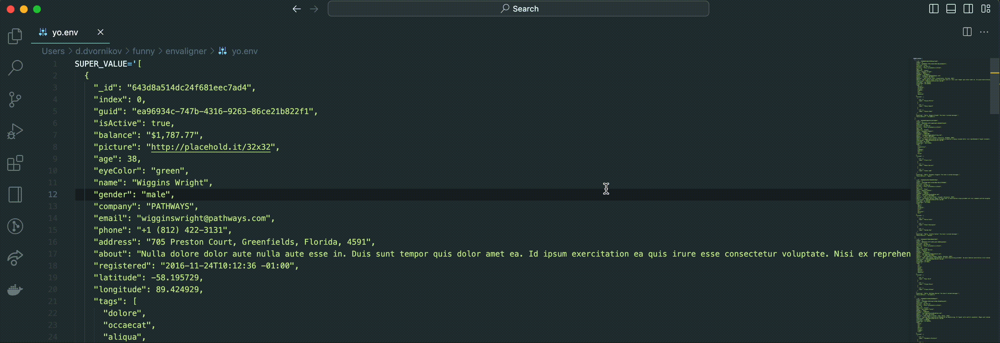

# envaligner README

The extension formats .env files.
The issue: https://github.com/microsoft/vscode-python/issues/9251
It appears in all the languages it supports using launch.json.
For now it's impossible to handle multi-line values (like json) in .env files.

### How to install:
- clone the repo
- npm install -g @vscode/vsce
- vsce package
- Follow the 
instruction 
from there: https://vscode-docs.readthedocs.io/en/stable/extensions/install-extension/

### Demo

### TODO:
- Make the extension as a default .env formatter (handle Shift+Opt+F)
